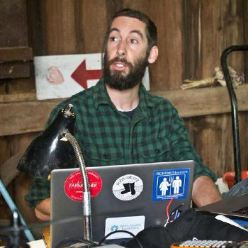
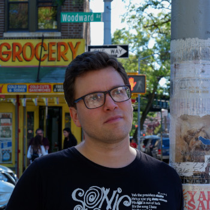
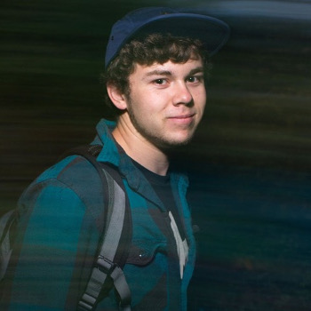

# Maintainers

### Michael Stenta

Founder, maintainer, and lead developer of
[farmOS](https://github.com/farmOS/farmOS)

* Github: [mstenta](https://github.com/mstenta)
* Drupal.org: [m.stenta](https://drupal.org/u/mstenta)

### Jamie Gaehring

Jamie Gaehring is a software engineer specializing in resilient systems for capturing agricultural data.
He maintains [farmOS Field Kit](https://github.com/farmOS/field-kit),
[farmOS.js](https://github.com/farmOS/farmOS.js) and [farmOS.org](https://github.com/farmOS/farmOS.org).

Prior to working with farmOS, he spent 10 years at GrowNYC, managing operations and publicity for the
Union Square Greenmarket. Although based in New York City, he has worked periodically at various farms
in southern New Jersey and Upstate New York. He is also a member of the Skywoman community, and an
organizing member of GOAT (Gathering for Open Agricultural Technology).

For more background on how he became involved with agriculture and free software,
you can read [his blog](https://jgaehring.com/blog/my-story).

* GitHub: [jgaehring](https://github.com/jgaehring)
* Twitter: [@JamieGaehring](https://twitter.com/JamieGaehring)
* [Personal Website](https://jgaehring.com)

### Paul Weidner

Frontend/backend developer, maintainer of
[farmOS Aggregator](https://github.com/farmOS/farmOS-aggregator) and
[farmOS.py](https://github.com/farmOS/farmOS.py)

* Github: [paul121](https://github.com/paul121)

