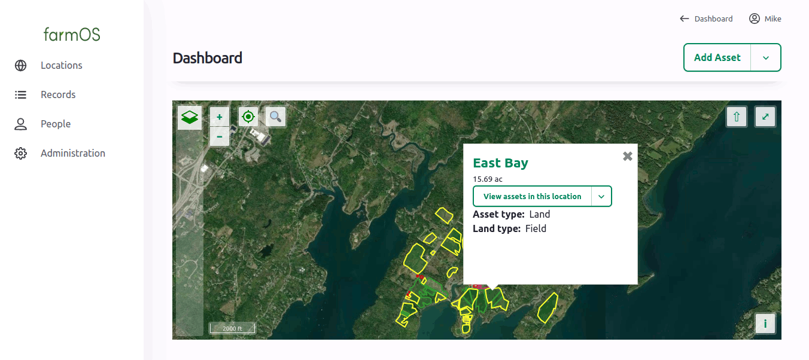

**farmOS is a web-based application for farm management, planning, and record
keeping. It is developed by a community of farmers, developers, researchers, and
organizations with the aim of providing a standard platform for agricultural
data collection and management.**

The farmOS server is built on top of [Drupal], which makes it [modular],
[extensible], and [secure]. The [farmOS Field Kit] app provides offline data
entry via a progressive web app (PWA) at [farmOS.app].

Both are licensed under the [GNU General Public License], which means they are
[free] and [open source]. All code is available in the [farmOS GitHub]
organization.

You can contribute to the project by [making a donation] or [contributing] in
other ways, or talk with developers and other users on the
[farmOS Community Forum].

## Get farmOS

See the [farmOS Hosting Guide] for an overview of hosting options.

If you would like to host farmOS yourself, read the [farmOS Installation Guide]
and the [farmOS Update Guide] to learn how.

## Follow farmOS

Subscribe to the [farmOS newsletter]
<iframe scrolling="no" style="width: 100% !important; height: 220px; border:1px #ccc solid !important" src="https://buttondown.email/farmOS?as_embed=true"></iframe>

<a rel="me" href="https://fosstodon.org/@farmOS">Follow @farmOS on fosstodon.org</a>
<iframe allowfullscreen sandbox="allow-top-navigation allow-scripts" style="width:100% !important; height:600px; border:1px #ccc solid !important;" src="https://www.mastofeed.com/apiv2/feed?userurl=https%3A%2F%2Ffosstodon.org%2Fusers%2FfarmOS&theme=light&size=100&header=true&replies=false&boosts=false"></iframe>

This site is powered by [Netlify](https://www.netlify.com)

[Drupal]: https://drupal.org
[modular]: http://en.wikipedia.org/wiki/Modular_programming
[extensible]: https://www.drupal.org/download
[secure]: http://www.drupal.org/documentation/is-drupal-secure
[farmOS Field Kit]: /guide/app
[farmOS.app]: https://farmOS.app
[User Guide]: /guide
[farmOS Community Forum]: https://farmOS.discourse.group
[making a donation]: /donate
[contributing]: /community/contribute
[GNU General Public License]: http://www.gnu.org/copyleft/gpl.html
[free]: https://en.wikipedia.org/wiki/Free_software
[open source]: http://en.wikipedia.org/wiki/Open_source
[farmOS GitHub]: https://github.com/farmOS
[farmOS newsletter]: https://buttondown.email/farmOS
[farmOS Hosting Guide]: /hosting
[farmOS Installation Guide]: /hosting/install
[farmOS Update Guide]: /hosting/update
